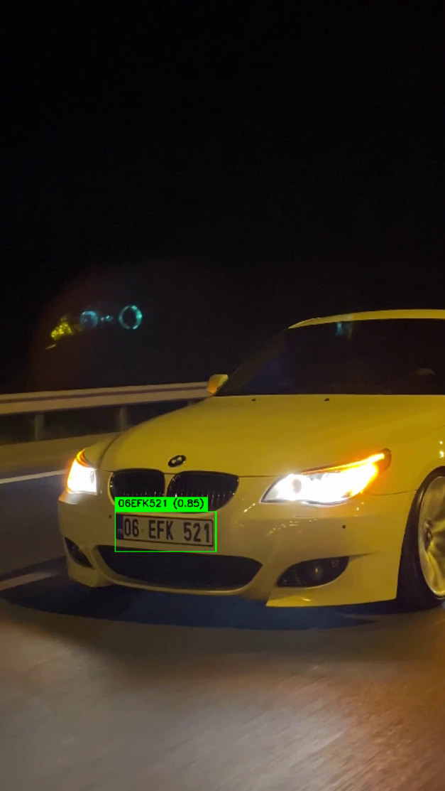

# License Plate Recognition (LPR) System

<table>
  <thead>
    <tr>
      <th>Real-time Demo 1</th>
      <th>Real-time Demo 2</th>
      <th>Real-time Demo 3</th>
    </tr>
  </thead>
  <tbody>
    <tr>
      <td>
        <video controls autoplay muted loop playsinline
               src="https://github.com/user-attachments/assets/510c54f4-cc77-4e30-b547-b621abbbb99c"
               style="width:100%; max-width:320px; border-radius:8px;"></video>
      </td>
      <td>
        <video controls autoplay muted loop playsinline
               src="https://github.com/user-attachments/assets/900abd4c-080a-4162-be33-eae887642cfb"
               style="width:100%; max-width:320px; border-radius:8px;"></video>
      </td>
      <td>
        <video controls autoplay muted loop playsinline
               src="https://github.com/user-attachments/assets/74651f0f-52d0-462f-bcf5-625700dab701"
               style="width:100%; max-width:320px; border-radius:8px;"></video>
      </td>
    </tr>
  </tbody>
</table>

<br/>

<table>
  <thead>
    <tr>
      <th>Real-time Demo 4</th>
      <th>Detection Screenshot</th>
    </tr>
  </thead>
  <tbody>
    <tr>
      <td>
        <video controls autoplay muted loop playsinline
               src="https://github.com/user-attachments/assets/aacd38f5-07b8-40d9-8e36-488ea044a211"
               style="width:100%; max-width:320px; border-radius:8px;"></video>
      </td>
      <td>
        
      </td>
    </tr>
  </tbody>
</table>

## Server Component

### Files
- `FOR_SERVER_ENVIROMENT/detection_server.py` - FastAPI server for real-time plate detection, tracking, and OCR
- `FOR_SERVER_ENVIROMENT/server_requirements.txt` - Server dependencies

### Description
The server component receives frames from the client, runs plate detection on each frame, tracks plates across frames, refreshes OCR periodically, and sends metadata back to the client over WebSockets. It uses:

- **YOLOv8** for license plate detection
- **OCR** for plate text recognition
- **FastAPI** for the server API and WebSocket endpoint
- **Real-time processing** with per-session plate tracking

### Features
- GPU acceleration support (CUDA)
- Plate tracking across frames
- Periodic OCR refresh with cached best-known plate results
- Confidence-based result filtering
- Real-time metadata streaming over WebSockets
- HTTP endpoint retained for single-frame testing

### API Endpoints
- `POST /detect_plates/` - Accepts a single image file and returns detections
- `WS /ws/detect` - Accepts JPEG frame messages and returns detection metadata in real time

### Response Format
```json
{
  "type": "detections",
  "detections": [
    {
      "track_id": 1,
      "bbox": [x1, y1, x2, y2],
      "text": "ABC123",
      "confidence": 0.85,
      "timestamp": 1710000000.0
    }
  ],
  "timestamp": 1710000000.0,
  "server_processing_time": 0.045
}
```

### Installation
```bash
# Install server dependencies
pip install -r FOR_SERVER_ENVIROMENT/server_requirements.txt
```

### Usage
```bash
python FOR_SERVER_ENVIROMENT/detection_server.py
```

## Client Component

### Files
- `FOR_CLIENT_ENVIROMENT/client_app.py` - Real-time camera/video client
- `FOR_CLIENT_ENVIROMENT/client_app_requirements.txt` - Client dependencies

### Description
The client component captures frames from a live camera or video file, resizes them for inference, sends them to the server over WebSockets, receives detection metadata, and draws overlays locally. It features:

- **Real-time video capture** using OpenCV
- **WebSocket communication** with the server
- **Adaptive inference and display sizing**
- **Local overlay rendering** using server metadata
- **Live visualization** of tracked detections

### Features
- Multi-threaded architecture
- Network error handling and recovery
- Latest-frame streaming
- Real-time visualization
- Camera or video-file input
- Configurable display and inference sizing

### Configuration
- Server URL: `ws://127.0.0.1:5000/ws/detect`
- Inference size: dynamically computed up to a configured max
- Display size: dynamically computed up to a configured max
- JPEG Quality: 100% (configurable)
- Camera index: 0 by default (configurable)

**Configuration Code Snippet:**
```python
# --- Configuration ---
SERVER_URL = "ws://127.0.0.1:5000/ws/detect"
MAX_INFERENCE_WIDTH = 960
MAX_INFERENCE_HEIGHT = 540
MAX_DISPLAY_WIDTH = 1280
MAX_DISPLAY_HEIGHT = 900
JPEG_QUALITY = 100 # 100% quality for best OCR
```

### Installation (Client Side)
```bash
# Install client dependencies
pip install -r FOR_CLIENT_ENVIROMENT/client_app_requirements.txt
```

### Usage
```bash
python FOR_CLIENT_ENVIROMENT/client_app.py
python FOR_CLIENT_ENVIROMENT/client_app.py --video "C:\path\to\video.mp4"
```

### Controls
- Press 'q' to quit the application

## System Architecture

```
Camera/Video → Client Capture → WebSocket Frame Stream → Server YOLO + Tracking + OCR → Metadata → Client Overlay
```

1. **Client** captures frames from a camera or video file
2. **Client** computes an inference resolution and JPEG-encodes the latest frame
3. **Client** sends frame bytes to the server over a WebSocket connection
4. **Server** detects license plates using YOLOv8 on every received frame
5. **Server** tracks detections per WebSocket session and refreshes OCR periodically
6. **Server** returns metadata containing `track_id`, `bbox`, `text`, `confidence`, and timestamps
7. **Client** draws overlays locally on the original displayed frame

## Performance Optimizations

### Server
- GPU acceleration for YOLO and OCR
- Plate tracking to maintain best-known results per vehicle
- Periodic OCR refresh instead of re-reading every track on every frame
- Shared single-frame HTTP path plus real-time WebSocket streaming path

### Client
- Latest-frame streaming instead of queue backlogs
- Non-blocking threaded capture and network flow
- Dynamic inference sizing for better quality/performance tradeoffs
- Local overlay rendering to avoid returning rendered video from the server

## Requirements

### Server Dependencies
- FastAPI
- OpenCV
- NumPy
- Ultralytics (YOLOv8)
- OCR runtime used by `detection_server.py`
- PyTorch
- Pillow
- Python-multipart

### Client Dependencies
- OpenCV
- websocket-client

## Notes
- Ensure the server is running before starting the client
- Update the SERVER_URL in the client for your specific server
- The client draws overlays locally using metadata returned by the server
- The system is optimized for real-time performance and lower latency
- GPU support provides significant speed improvements
